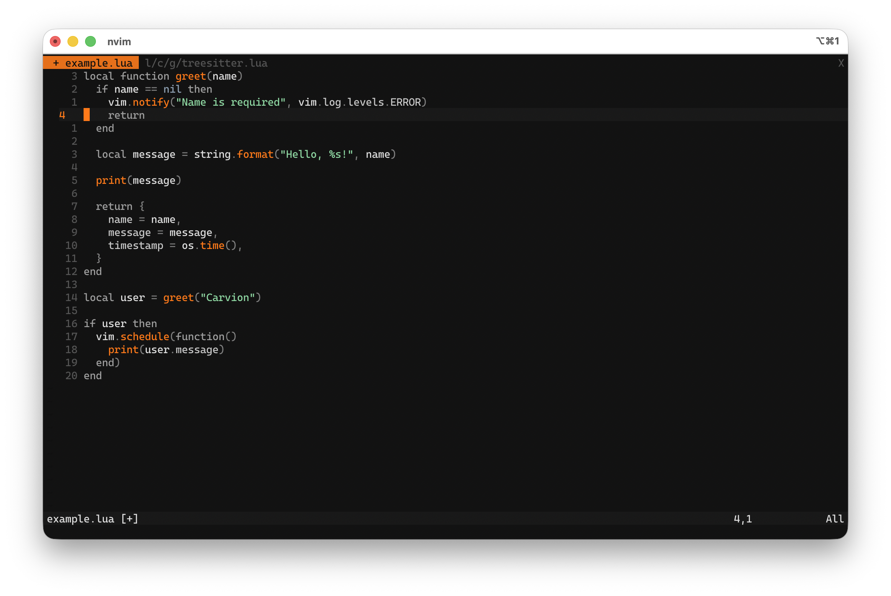

# Carvion

Carvion.nvim is a modular colorscheme for Neovim focused on clarity
consistency, and extensibility.



## Requeriments

Minimum requirements:

- Neovim >= 0.9.0

## Installation

Install using your preferred plugin manager.

### vim.pack:

> [!CAUTION]
> This method is only available in Neovim >= 0.12.0

Using the built-in package manager:

```lua
  vim.pack.add({
    { src = "https://github.com/zitrocode/carvion.nvim", name = 'carvion' }
  })
```

For more details see: `:help vim.pack`

### Lazy.nvim

```lua
  { "zitrocode/carvion.nvim", lazy = false, priority = 1000, opts = {} }
```

For more details see: <https://github.com/folke/lazy.nvim>

### Packer.nvim

```lua
  use { "zitrocode/carvion.nvim", as="carvion" }
```

For more details see: <https://github.com/wbthomason/packer.nvim>

## Usage

Enabled the colorscheme:

```lua
  vim.cmd.colorscheme('carvion')
```

## Configuration

Carvion.nvim provides optional configuration using:

```lua
  require('carvion').setup({})
```

### Default configuration:

```lua
  require("carvion").setup({
    transparent = false,
    styles = {
      comments = { italic = true },
      keywords = {},
      functions = {},
      variables = {},
      strings = {},
      types = {}
    }
  })
```

### Transparent

Disable background colors.

Example:

```lua
  require('carvion').setup({
    transparent = true
  })
```

### Styles

Apply highlights styles to specific syntax group.
Each value accepts any valid highlight attribute supported by |nvim_set_hl|

Example:

```lua
  require('carvion').setup({
    styles = {
      comments = { italic = true },
      functions = { italic = true },
      keywords = { bold = true }
    }
  })
```

Available style groups `comments`, `keywords`, `functions`, `variables`,
`strings` and `types`.

# Supported Plugins

Carvion.nvim includes highlight support for selected plugins.

### Currently Supported

- [nvim-treesitter](https://github.com/nvim-treesitter/nvim-treesitter)

Plugin highlights are loaded automatically when the plugins in available.

If a plugin you use is not supported yet, you can:

- Open an issue
- Submit a pull request with highlight definitions

For more details see: <https://github.com/zitrocode/carvion.nvim>

## License

Carvion.nvim is distributed under the MIT License.
For full licence text see: `LICENSE`
